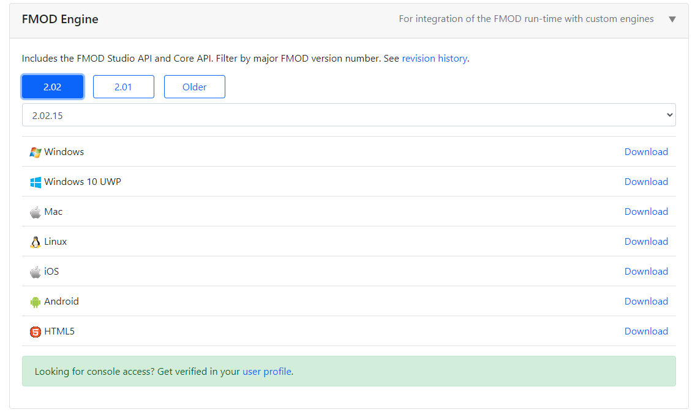
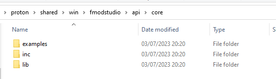

# RTDink -- Build Instructions

See [README.md](README.md) for download links if you just want to play the game.

## Platform Overview

| Platform | Build System | Notes |
|----------|-------------|-------|
| **Windows** | Visual Studio 2017+ | Proton SDK sibling layout, uses FMOD for audio |
| **Linux** | CMake | Proton SDK cloned inside project, uses SDL2 + SDL2_mixer for audio |
| **iOS** | Xcode | Proton SDK sibling layout, uses FMOD for audio |
| **Android** | Gradle + CMake | Proton SDK sibling layout, uses FMOD for audio |
| **macOS** | Xcode | Universal binary (Intel + Apple Silicon), uses SDL2 + SDL2_mixer for audio (see [macOS section](#macos)) |
| **HTML5** | Emscripten | See [Proton HTML5 setup](https://www.rtsoft.com/wiki/doku.php?id=proton:html5_setup) |

All platforms require the **Dink Smallwood game data** (`dink/` directory) to play. It ships in this repo under `bin/dink`; the official installers on the [README download page](README.md#download) include it too.

Most platforms (except Linux) expect the **Proton SDK sibling layout** -- RTDink is cloned inside the Proton directory:

```
proton/
  shared/          <-- Proton SDK
  RTDink/          <-- this repo
```

---

## Windows

RTDink is cloned inside the Proton SDK tree:

```
proton/
  shared/          <-- Proton SDK
  RTDink/          <-- this repo
    windows_vs2017/
      iPhoneRTDink.sln
```

### Step 1 - Getting the Proton SDK and building RTSimpleApp

1. Clone the Proton SDK: `git clone https://github.com/SethRobinson/proton`

2. Run `proton\RTSimpleApp\media\update_media.bat` to prepare the Proton texture and sound assets

3. Open `proton\RTSimpleApp\windows_vc\RTSimpleApp.sln`

4. Select `DebugGL | x64` or `ReleaseGL | x64` configuration, build and run it -- it should work!

NOTE: If you want to build for Win32, you will have to manually copy the 32 bit versions of the following dll files:
* `proton\shared\win\lib\zlib1.dll`
* `proton\shared\win\lib\audiere\bin\audiere.dll`

To restore 64 bit libraries, copy these instead:
* `proton\shared\win\lib\zlib1.dll`
* `proton\shared\win\lib\64\zlibwapi.dll`
* `proton\shared\win\lib\audiere\lib64\audiere.dll`

If you have any issues, check out these two pages for more info on the Proton engine:
* https://www.rtsoft.com/wiki/doku.php?id=proton:win_setup
* https://www.rtsoft.com/wiki/doku.php?id=proton:win_setup2

### Step 2 - Getting FMOD and building RTSimpleApp in FMOD mode

1. Get the **FMOD Studio API** from https://www.fmod.com/download#fmodengine (you will need to register an account)



2. Extract the API files into `proton\shared\win\fmodstudio\`

3. NOTE: You don't need to *INSTALL* the FMOD Engine, you just need to extract the `api\core` subfolder, which you can do with 7zip for example



4. Open `proton\RTSimpleApp\windows_vc\RTSimpleApp.sln` once again

5. Select the `DebugFMOD_GL | x64` or `ReleaseFMOD_GL | x64` configuration -- it should build just fine

6. Copy the FMOD dll into the output folder `proton\RTSimpleApp\bin`:
   * `proton\shared\win\fmodstudio\api\core\lib\x64\fmod.dll`

7. The RTSimpleApp with FMOD enabled should run now!

### Step 3 - Building and running RTDink

1. Go into the `proton` root folder and clone the RTDink repo: `git clone https://github.com/SethRobinson/RTDink`

2. Run `proton\RTDink\media\update_media.bat` to prepare the Proton texture and sound assets (optional)

3. Open `proton\RTDink\windows_vs2017\iPhoneRTDink.sln`

4. Select the `Debug GL | x64` or `Release GL | x64` configuration and build

5. Copy the required x64 DLLs and curl certificate into `proton\RTDink\bin`:
   * `proton\shared\win\fmodstudio\api\core\lib\x64\fmod.dll`
   * `proton\shared\win\lib\zlib1.dll`
   * `proton\shared\win\lib\64\zlibwapi.dll`
   * `proton\shared\win\lib\x64\libcurl-x64.dll`
   * `proton\shared\win\lib\x64\libcrypto-1_1-x64.dll`
   * `proton\shared\win\lib\x64\libssl-1_1-x64.dll`
   * `proton\shared\win\lib\x64\curl-ca-bundle.crt`

6. Your Dink Smallwood HD build should be ready to run!

---

## iOS

The Xcode project at the repo root (`RTDink.xcodeproj`) includes iOS targets. It uses the Proton SDK sibling layout:

```
proton/
  shared/          <-- Proton SDK
  RTDink/
    RTDink.xcodeproj
```

1. Clone [Proton SDK](https://github.com/SethRobinson/proton)
2. Clone this repo inside the Proton directory
3. Open `RTDink.xcodeproj` in Xcode
4. Select the iOS target/device and build
5. You will need an Apple Developer account for device deployment

---

## Android

The Android build uses Gradle with CMake for native code. It uses the Proton SDK sibling layout:

```
proton/
  shared/          <-- Proton SDK
  RTDink/
    AndroidGradle/
      app/
        src/main/cpp/CMakeLists.txt   <-- references ../../../../../../shared
```

1. Clone [Proton SDK](https://github.com/SethRobinson/proton)
2. Clone this repo inside the Proton directory
3. Copy `AndroidGradle/local.properties_removethispart_` to `AndroidGradle/local.properties` and edit it with your Android SDK path, keystore info, and package name
4. Run `media\update_media.bat` to prepare assets (or ensure `bin/interface` and `bin/audio` exist)
5. Open `AndroidGradle/` in Android Studio
6. `PrepareResources.bat` runs automatically during the build to copy assets and shared Java sources from the Proton SDK
7. Build and deploy

**Note:** The game data for Android comes from `bin/dink_for_android/` (a trimmed version of the game data). See `PrepareResources.bat` for details on what gets packaged into the APK.

---

## macOS

The macOS build uses the Xcode project at `OSX/RTDink.xcodeproj`.

- **Supported architectures:** Universal binary, runs natively on both **Intel (x86_64)** and **Apple Silicon (ARM64 / M1+)**.
- **Audio:** Uses **SDL2** + **SDL2_mixer**, no FMOD required.
- **Distribution builds** embed the SDL2 frameworks inside the `.app` (done by the packaging script, see below), so the shipped game needs no SDL2 install on the player's machine.

### Directory layout

Clone this repo **inside** the Proton SDK checkout (same layout as Windows and iOS):

```
proton/                <-- Proton SDK (cloned first)
  shared/
  RTSimpleApp/
  RTDink/              <-- this repo (cloned inside proton/)
    OSX/
      RTDink.xcodeproj
```

The Xcode project references `../../shared/` and `../../RTSimpleApp/` relative to `OSX/`.

### Steps

1. Clone the Proton SDK, then this repo inside it:

```bash
git clone https://github.com/SethRobinson/proton.git
cd proton
git clone https://github.com/SethRobinson/RTDink.git
```

2. Install the **SDL2** and **SDL2_mixer** frameworks (official universal DMG releases):

```bash
mkdir -p ~/Library/Frameworks

curl -L -o /tmp/SDL2.dmg "https://github.com/libsdl-org/SDL/releases/download/release-2.30.9/SDL2-2.30.9.dmg"
hdiutil attach /tmp/SDL2.dmg
ditto /Volumes/SDL2/SDL2.framework ~/Library/Frameworks/SDL2.framework
hdiutil detach /Volumes/SDL2

curl -L -o /tmp/SDL2_mixer.dmg "https://github.com/libsdl-org/SDL_mixer/releases/download/release-2.8.0/SDL2_mixer-2.8.0.dmg"
hdiutil attach /tmp/SDL2_mixer.dmg
ditto /Volumes/SDL2_mixer/SDL2_mixer.framework ~/Library/Frameworks/SDL2_mixer.framework
hdiutil detach /Volumes/SDL2_mixer
```

> **Important:** copy the frameworks with `ditto` (or `cp -R`), never `cp -r`. `cp -r` follows the internal symlinks and flattens the framework structure, which breaks code signing later.

3. Build. Either open `OSX/RTDink.xcodeproj` in Xcode and hit Cmd-B (Release), or from a terminal:

```bash
cd RTDink/OSX
xcodebuild -project RTDink.xcodeproj -configuration Release build
```

A "Generate pnglibconf.h" build phase creates the required libpng config header automatically on first build. The built app lands in `OSX/build/Release/`. Development builds load SDL2 from `~/Library/Frameworks`.

### Release packaging (signing, notarization, DMG)

`script/BuildAndPackageMac.sh` builds the universal binary, embeds the SDL2 frameworks, signs everything with the Developer ID identity (hardened runtime), creates the DMG, notarizes it with Apple and staples the ticket. It can be driven from a Windows box with `script/BuildMac.bat`, which pushes the source over ssh, runs the script on the Mac, and copies the finished DMG back. See the comments at the top of both scripts for the one-time credential setup.

---

## Linux

### Install via Flatpak (recommended for most users)

No build required. Use the correct bundle for your CPU:

- **x86_64 (Intel/AMD):** [DinkSmallwoodHD-x86_64.flatpak](https://www.rtsoft.com/dink/DinkSmallwoodHD-x86_64.flatpak)
- **aarch64 (ARM 64-bit, e.g. Raspberry Pi 4, Jetson, Apple Silicon in Linux):** [DinkSmallwoodHD-aarch64.flatpak](https://www.rtsoft.com/dink/DinkSmallwoodHD-aarch64.flatpak)

```sh
# Install Flatpak if needed (Debian/Ubuntu)
sudo apt install flatpak

# Download and install (example for x86_64)
wget https://www.rtsoft.com/dink/DinkSmallwoodHD-x86_64.flatpak
flatpak install --user DinkSmallwoodHD-x86_64.flatpak

# Run
flatpak run com.rtsoft.DinkSmallwoodHD
```

On ARM, use `DinkSmallwoodHD-aarch64.flatpak` instead.

### Build from source

#### Quick setup (Ubuntu/Debian)

The easiest way is to use the automated script from the repo root:

```sh
./linux_setup.sh
```

This installs dependencies, clones the Proton SDK, and builds RTDink. Game data is included in the repo.

#### Manual build

#### Prerequisites

- **C++ Compiler:** GCC 7+ or Clang 7+
- **CMake:** 3.10 or newer
- **Development libraries:**

```sh
sudo apt update
sudo apt install build-essential cmake libgl1-mesa-dev libx11-dev \
  libpng-dev zlib1g-dev libbz2-dev libcurl4-openssl-dev libsdl2-dev libsdl2-mixer-dev
```

#### Build steps

```sh
# 1. Clone Proton SDK inside the project root
git clone https://github.com/SethRobinson/proton.git

# 2. Configure and build
mkdir build && cd build
cmake ..
make -j$(nproc)

# 3. Run (game data is in the repo under bin/dink)
./RTDinkApp
```

CMake automatically creates symlinks for `interface/`, `audio/`, and `dink/` so the binary finds resources when run from `build/`.

### Troubleshooting

- **Missing dependencies:** Install any missing `-dev` packages as reported by CMake.
- **No game data:** The `dink/` game data is included in the repo (under `bin/dink/`). If it is missing, the game will crash when starting a new game.

---

## Notes

- The Linux CMake build is independent from the Windows/macOS project files -- they can coexist safely.
- The Linux build uses SDL2 + SDL2_mixer for audio instead of FMOD (no proprietary dependencies).
- Proton SDK must be obtained separately on each platform.
- Contributions and bug reports are welcome!
