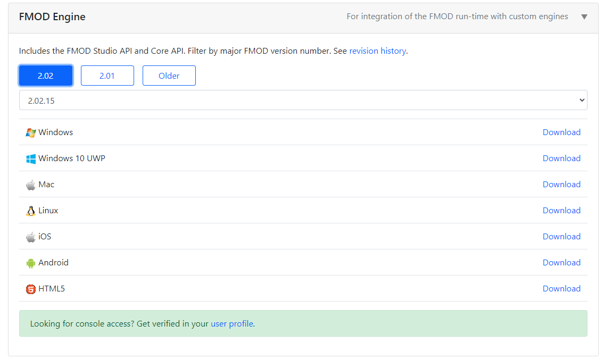
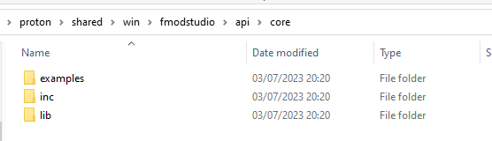

# Dink Smallwood HD

## To just download working versions to play Dink Smallwood:

Visit https://www.rtsoft.com/pages/dink.php for installers for Windows, Mac, iOS, Android

The latest version should also be mirrored on The Dink Network: https://www.dinknetwork.com/file/dink_smallwood_hd/

## How to compile and run the source to create dink.exe on Windows using Visual Studio 2022:
### Step 1 - Getting the Proton Engine and building RTSimpleApp

1. Clone the proton engine from https://github.com/SethRobinson/proton

`git clone https://github.com/SethRobinson/proton`
2. Run `proton\RTSimpleApp\media\update_media.bat` to prepare the proton texture and sound assets

3. Open `proton\RTSimpleApp\windows_vc\RTSimpleApp.sln`

4. Select `DebugGL | x64` or `ReleaseGL | x64` configuration, build and run it, it should work!

NOTE: If you want to build for Win32, you will have to manually copy the 32 bit versions of the following dll files:
* `proton\shared\win\lib\zlib1.dll`
* `proton\shared\win\lib\audiere\bin\audiere.dll`

To restore 64 bit libraries, copy these instead:
* `proton\shared\win\lib\zlib1.dll`
* `proton\shared\win\lib\64\zlibwapi.dll`
* `proton\shared\win\lib\audiere\lib64\audiere.dll`

If you have any issues, check out these two pages for more info on the Proton engine:
* https://www.rtsoft.com/wiki/doku.php?id=proton:win_setup
* https://www.rtsoft.com/wiki/doku.php?id=proton:win_setup2

### Step 2 - Getting FMOD and Building RTSimpleApp in FMOD mode
1. You need to get the **FMOD Studio API**, head on over to https://www.fmod.com/download#fmodengine and download the latest version of **FMOD Engine**, which comes with the **FMOD Studio API** 

**IMPORTANT NOTE: You will need to register an account!!**

2. Extract the API files into this location `proton\shared\win\fmodstudio\`

3. NOTE: You don't need to *INSTALL* the FMOD Engine, you just need to extract the `api\core` subfolder, which you can do with 7zip for example

4. Open `proton\RTSimpleApp\windows_vc\RTSimpleApp.sln` once again

5. Select the `DebugFMOD_GL | x64` or `ReleaseFMOD_GL | x64` configuration, it should build just fine.

6. Before you can run the build, you will need to copy over the fmod dll files into the output folder `proton\RTSimpleApp\bin`:
* `proton\shared\win\fmodstudio\api\core\lib\x64\fmod.dll`

7. The RTSimpleApp with FMOD enabled should run now!

### Step 3 - Finally, building and running RTDink

1. Go into the `proton` root folder and clone the RTDink repo

`git clone https://github.com/SethRobinson/RTDink`

2. Run `proton\RTDink\media\update_media.bat` to prepare the proton texture and sound assets

3. Open `proton\RTDink\windows_vs2017\iPhoneRTDink.sln`

4. Select the `Debug GL | x64` or `Release GL | x64` configuration, if you installed everything correctly so far, it should build just fine, however, it won't run just yet!

5. You need to also copy the required x64 dll files and the certificate for curl into the output folder `proton\RTDink\bin`:
* `proton\shared\win\fmodstudio\api\core\lib\x64\fmod.dll`
* `proton\shared\win\lib\zlib1.dll`
* `proton\shared\win\lib\64\zlibwapi.dll`
* `proton\shared\win\lib\x64\libcurl-x64.dll`
* `proton\shared\win\lib\x64\libcrypto-1_1-x64.dll`
* `proton\shared\win\lib\x64\libssl-1_1-x64.dll`
* `proton\shared\win\lib\x64\curl-ca-bundle.crt`

6. Your DinkHD build should run now, but you are not quite done! You also need the Dink game assets, or your application will crash when you try to start a new game. To get those, simply download an official distribution of DinkHD or DinkV1.08 and copy the `dink` subfolder from there to your `proton\RTDink\bin` folder!
* You can download the official releases of DinkHD from https://www.rtsoft.com/pages/dink.php or https://www.dinknetwork.com/file/dink_smallwood_hd/ 
* You can also download the classic Dink V1.08 from https://www.dinknetwork.com/file/dink_smallwood/

You can get the `dink` game assets from either of these releases.

7. Your DinkHD should finally work now!

### Other notes:

#### Have a bugfix or patch?! Please send it over to Seth!  Please note that any submission (code, media, translations, ect) must be 100% compatible with the license as listed in the source license!

* To build the HTML5 version, check out https://www.rtsoft.com/wiki/doku.php?id=proton:html5_setup

* See script/installer/readme.txt for what's new info.

* While this is the source code used for the mobile versions too, not everything is included to build those versions
 

* By default, Proton SDK's main.cpp is setup to compile for iPhone most likely.  Assuming you'd rather not have an iPhone build, search the project for "//WORK: Change device emulation here" and right under that,
  change it from string desiredVideoMode = "iPhone Landscape"; or whatever it was to "string desiredVideoMode = "Windows"; instead.  (this is where you can emulate many devices and sizes)

**NOTE: this is no longer the case, currently the https://github.com/SethRobinson/proton repo is configured for windows by default!** However, keep this in mind if for some reason you want to use an older version of Proton / RTDink!

