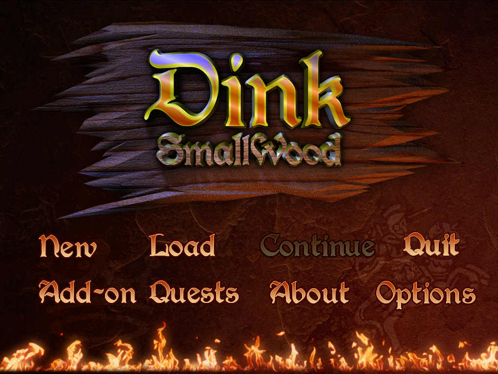
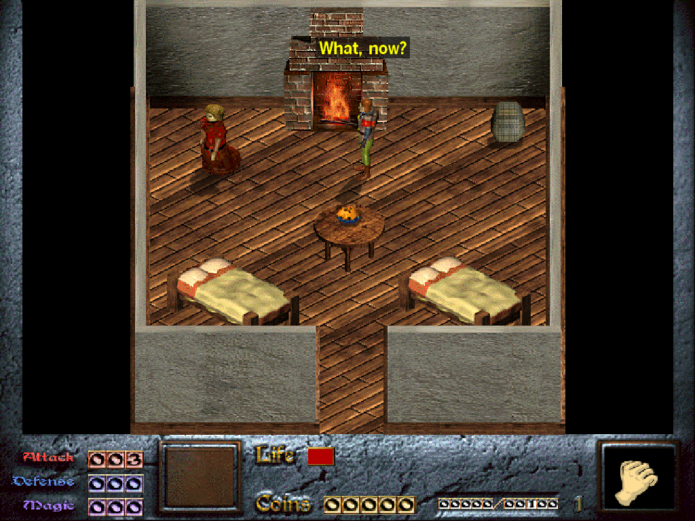

# Dink Smallwood HD

An enhanced, portable version of **Dink Smallwood**, the classic 1997 action RPG by RTsoft. Dink HD adds smooth-scrolling high-res rendering, gamepad and touchscreen support, quick save/load, and a built-in browser that can download and install hundreds of fan-made add-on quests (DMODs) from [The Dink Network](https://www.dinknetwork.com/).

<p>


</p>

## Download

| Platform | Get it |
|----------|--------|
| **Windows** | [DinkSmallwoodHDInstaller.exe](https://www.rtsoft.com/dink/DinkSmallwoodHDInstaller.exe) |
| **macOS** | [DinkSmallwoodHD.dmg](https://www.rtsoft.com/dink/DinkSmallwoodHD.dmg) (universal, Intel + Apple Silicon, macOS 11+) |
| **Linux** | Flatpak, one command (see below) |
| **iOS / Android** | Store links at [rtsoft.com/pages/dink.php](https://www.rtsoft.com/pages/dink.php) |

Linux install (any distro with [Flatpak](https://flatpak.org/setup/); on ARM devices replace `x86_64` with `aarch64`):

```bash
wget https://www.rtsoft.com/dink/DinkSmallwoodHD-x86_64.flatpak && flatpak install --user -y DinkSmallwoodHD-x86_64.flatpak && flatpak run com.rtsoft.DinkSmallwoodHD
```

Downloads are also mirrored on [The Dink Network](https://www.dinknetwork.com/file/dink_smallwood_hd/).

## Building from source

Dink HD builds for Windows, macOS, Linux, iOS, Android, and HTML5 using the [Proton SDK](https://github.com/SethRobinson/proton). All build instructions live in **[INSTALL.md](INSTALL.md)**.

Linux users can build and play from source with a single command:

```bash
curl -sL https://raw.githubusercontent.com/SethRobinson/RTDink/master/linux_setup.sh | bash
```

## Credits

The original **Dink Smallwood** (1997) was created by **Seth A. Robinson**, **Justin Martin**, **Greg Smith**, and **Shawn Teal**, with additional music by **Joel Bakker** and **Mitch Brink**.

### Source contributors

* **drone1400** -- division-by-zero fix, pixel-perfect rendering, and build improvements
* **Dan Walma** -- headed up the 1.08 release and has done a million other things
* **yeoldtoast** -- editors and a bunch of other Dink stuff
* **RobJ** -- DinkC command fixes and compatibility improvements
* **SimonK** -- DMOD stress testing and limit increase requests
* **Mateus Sales Bentes** -- Linux port work, macOS universal binary (Intel + Apple Silicon)

Special thanks to the entire [dinknetwork.com](https://www.dinknetwork.com/) community for their Dink creations and support over the years!

## Other notes

* **Have a bugfix or patch?** Please submit it as a pull request! Any submission (code, media, translations, etc) must be 100% compatible with this repo's license and the PR personally checked by a human.
* Version history is in [script/win_installer/readme.txt](script/win_installer/readme.txt).
